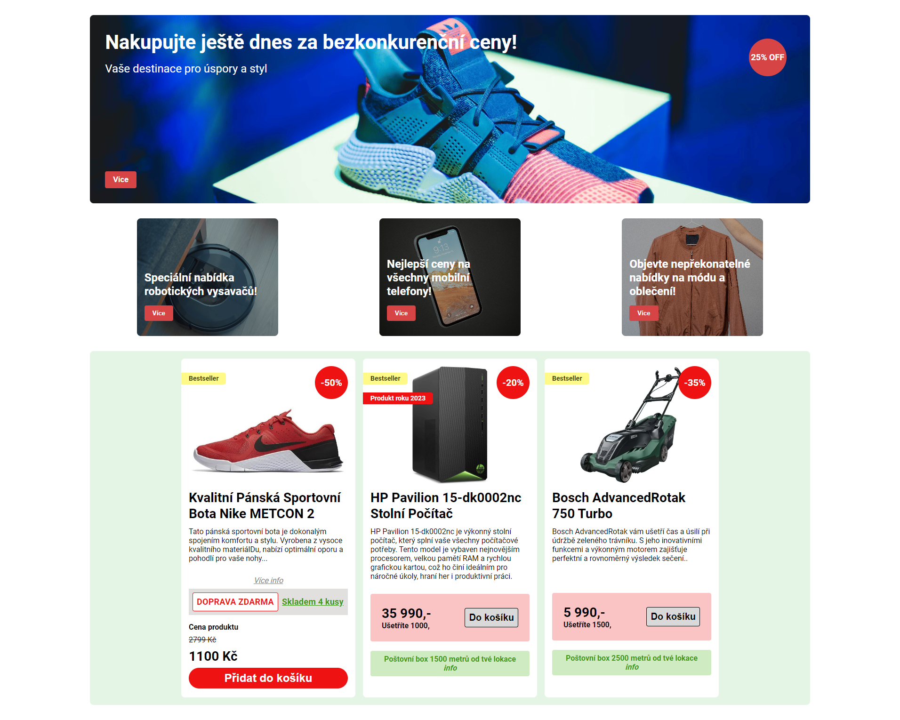
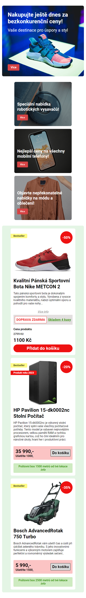

# EN - Engeto.cz - Homework - Lesson 4.1: Introduction to Flexbox
 
## Task
This bonus task is intended for reviewing working with images, media queries, and flexbox, as described in lesson <b>4.1: Introduction to Flexbox</b> in the <a href="https://engeto.cz/webova-akademie/">Engeto Front-end Developer Academy</a>. The task is completed in VS Code and can be compared with the reference solution in the files indexRefer.html and styleRefer.css.

The goal is to create a simple responsive page with hero, promo, and card sections. The desktop version of the page should resemble the image. For mobile, items in the second and third sections will be stacked vertically. You can find the reference solution for the page at this link.

### Task Preview

### My Solution Preview
#### Desktop Version 💻

#### Mobile Version 📲

# CZ - Engeto.cz - Domácí úkol - Lekce 4.1: Úvod do flexboxu

## Zadání

Tento bonusový úkol slouží k zopakování práce s obrázky, media-query a flexboxu, který je popsán v lekci <b>4.1: Lekce 4.1: Úvod do flexboxu</b> v <a href="https://engeto.cz/webova-akademie/">Engeto Front-end Developer Akademii</a>. Úkol je vypracován ve VS Code a je možné jej porovnat s referenčním řešením níže v souborech **indexRefer.html** a **styleRefer.css**.

Cílem je vytvořit jednoduchou responzívní stránku s hero, promo a card sekci. Stránka pro desktop bude vypadat jako na obrázku. Pro mobil se položky v druhé a třetí sekci zoradí pod sebou. Referenční řešení stránky najdete na tomto <a href="https://charming-torrone-ffb267.netlify.app/" title="lekce 4.1 - flexbox domácí úkol">linku.

### Náhled zadání

### Náhled mého řešení
#### Desktop verze 💻

#### Mobilní verze 📲

