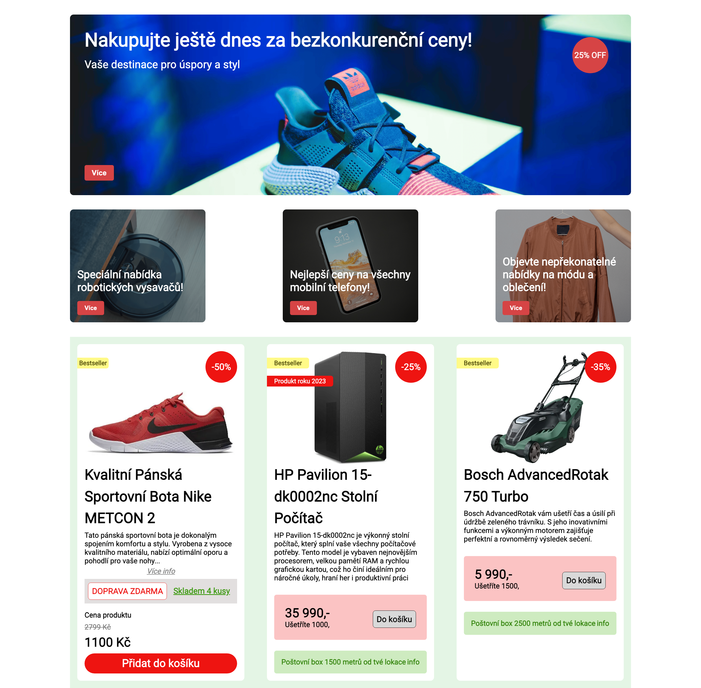

# CZ - Engeto.cz - Domácí úkol - Lekce 4.1: Úvod do flexboxu

## Zadání

Tento bonusový úkol slouží k zopakování práce s obrázky, media-query a flexboxu, který je popsán v lekci <b>4.1: Lekce 4.1: Úvod do flexboxu</b> v <a href="https://engeto.cz/webova-akademie/">Engeto Front-end Developer Akademii</a>. Úkol je vypracován ve VS Code a je možné jej porovnat s referenčním řešením níže v souborech **indexRefer.html** a **styleRefer.css**.

Cílem je vytvořit jednoduchou responzívní stránku s hero, promo a card sekci. Stránka pro desktop bude vypadat jako na obrázku. Pro mobil se položky v druhé a třetí sekci zoradí pod sebou. Referenční řešení stránky najdete na tomto <a href="https://charming-torrone-ffb267.netlify.app/" title="lekce 4.1 - flexbox domácí úkol">linku.

### Náhled zadání

